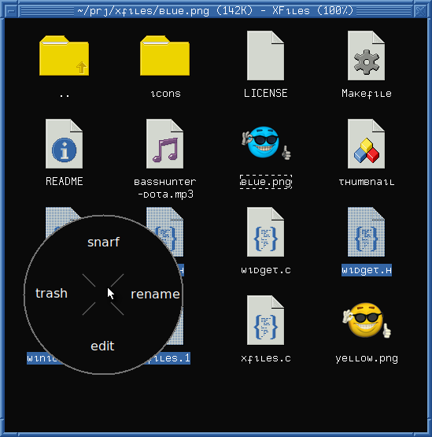

# XFiles

  

This is a file manager for X11.  It can navigate through directories,
show icons for files, select files, call a command to open files,
generate thumbnails, and call a command to run on right mouse button
click.

XFiles depends on a few environment variables to be usable:

* `OPENER`: Program to be called to open files.  Defaults to `xdg-open`.
* `XFILES_THUMBNAILDIR`: Path to directory where thumbnails must be cached.

XFiles can be customized by setting the following X resources:

* `XFiles.faceName`:      Font for drawing text.
* `XFiles.background`:    Background color.
* `XFiles.foreground`:    Text color.
* `XFiles.selbackground`: Background color for selected entries.
* `XFiles.selforeground`: Text color for selected entries.

**WARNING!**

XFiles now uses a shell script for additional operation on files.

Previously, there was this optional `XFILES_CONTEXTCMD` environment
variable that was called to pop up a menu when right-clicking.

With the addition of drag-and-drop, it became necessary to use the
script for moving/copying the dropped files as well.

XFiles now uses a script called `xfilesctl` (for XFiles Controller) that
handles both menu and file dropping.  An example script is provided, but
it relies on a few programs from [fmutils], a collection of small
scripts for file management.

[fmutils]: https://github.com/phillbush/fmutils

I highly recommend you to read this script and change it to fit your
needs.

## Opening

The opener program is called with the highlighted file's path as
argument.  If not specified with the `OPENER` environment variable, it
defaults to xdg-open (I recommend you to use [plumb] instead).

[plumb]: https://github.com/phillbush/plumb

## Icons & Thumbnails

XFiles can show icons for files based on their type (regular file,
directory, link, executable, etc) and on a glob pattern they should
match against.  Icons are and included in the source code.  Changing,
adding or removing an icon requires editing `config.c` and recompiling
XFiles.

XFiles can also generate and cache thumbnails for a few files, such as
images and videos.  Thumbnails are generated by calling programs like
ImageMagick's convert and ffmpegthumbnailer.  The commands to call are
configured in the source code at `config.c`.  Changing them requires
recompiling XFiles.

For thumbnails to work, the environment variable `XFILES_THUMBNAILDIR`
must be set to the path of an existing writeable and readable directory
where thumbnails will be cached.

## Questions

### Why change the icon/thumbnail system

For XFiles to work out of the box, it needed some default icons.  At
first I was using only two icons: the folder and file ones.  All other
icons needed to be set with an environment variable.

But that was weird to have some icons configured at compile time while
others configured at runtime.  I made them all icons configurable at
compile time via the `config.c` source file.

Thumbnails also use the same glob/pattern matching system as icons;
and are configured the same way.

### How can I open/edit xpm icons?

XFiles comes with a set of icons in `./icons`; you can use them,
or you can use any set of 64x64 `.xpm` icons.
(Yes, they must be 64x64 pixels wide and in the `.xpm` format).

You can open xpm files with [feh](https://feh.finalrewind.org/), or
your preferred image viewer if it supports it.

[Xpm](https://en.wikipedia.org/wiki/X_PixMap) is a file format meant
solely for icons, and is not intended to be used for general images
(especially colorful, vivid ones).  It has the feature that it can be
easily [edited in a text editor](https://upload.wikimedia.org/wikipedia/commons/b/b3/Screenshot-xterm-linux.xpm-GVIM.png).
The GIMP (GNU Image Manipulation Program) also supports exporting into
XPM files.

### Why there are no thumbnail/miniatures?

You must set the `XFILES_THUMBNAILDIR` environment variables to the path
of a directory where thumbnails will be cached.  You also need to have
the following programs installed:

* ImageMagick's convert(1): To generate thumbnail for images.
* ffmpegthumbnail(1): To generate thumbnail for videos.
* rsvg-convert(1): To generate thumbnail for svg files.
* pdftoppm(1): To generate thumbnail for pdf.
* ffmpeg(1): To generate thumbnail for audio files.

### Why XPM for icons?

XPM is the default file format for icons in X11.  It is used for small
images with few colors, just like icons.  One can easily draw xpm icons
with a text editor and change the colors on a bunch of xpm files with a
simple shell script.

### Why PPM for thumbnails?

Thumbnails need to be quickly decoded and processed for a smooth file
browsing.  PPM is a raw image format that needs no decoding.  That
means, however, that there is no compression involved.  But thumbnails
are at most 64x64 pixels in size, so there's no need for compression as
the files are small.

### What is that thing that opens on middle click?

That's the scroller, it replaces the scrollbar.  It can be used either
as a scrollbar, by dragging the handle with the left mouse button; or as
Firefox's autoScroll feature, by moving the cursor up and down while
holding no button at all.

### How can I enable autoScroll on Firefox?

Set `general.autoScroll` to True on about:config.
(Bro tip: do it).

### Is there a context menu?

Not natively.  You should use a menu application like xmenu or pmenu
for that.

### Why the mouse cursor does not change while drag-and-dropping?

The mouse cursor changes while dragging files to indicate that a
drag-and-drop operation is occurring.  It depends on the mouse cursor
theme to have such special cursors.  It seems that the default X11 mouse
cursor theme does not have them.  I highly recommend you to install a
complete cursor theme.

### How can I copy/move/rename/delete files?

Use the context command for such operations.  For copying and moving, I
save the files into the clipboard with `xsel(1)` and then retrieve it
when pasting.  You can check my context script at my [dotfiles].

[dotfiles]: https://github.com/phillbush/home/blob/668c9929b724417671d95432e1eedc98b1d82cb2/execs/xfiles-menu

## License

The code and manual are under the MIT/X license.
See `./LICENSE` for more information.

The icons are in CC0/Public Domain.
